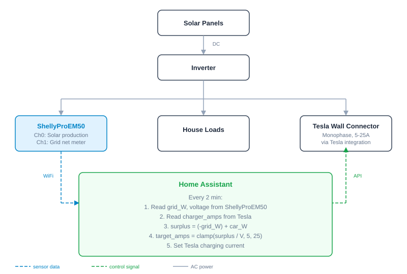
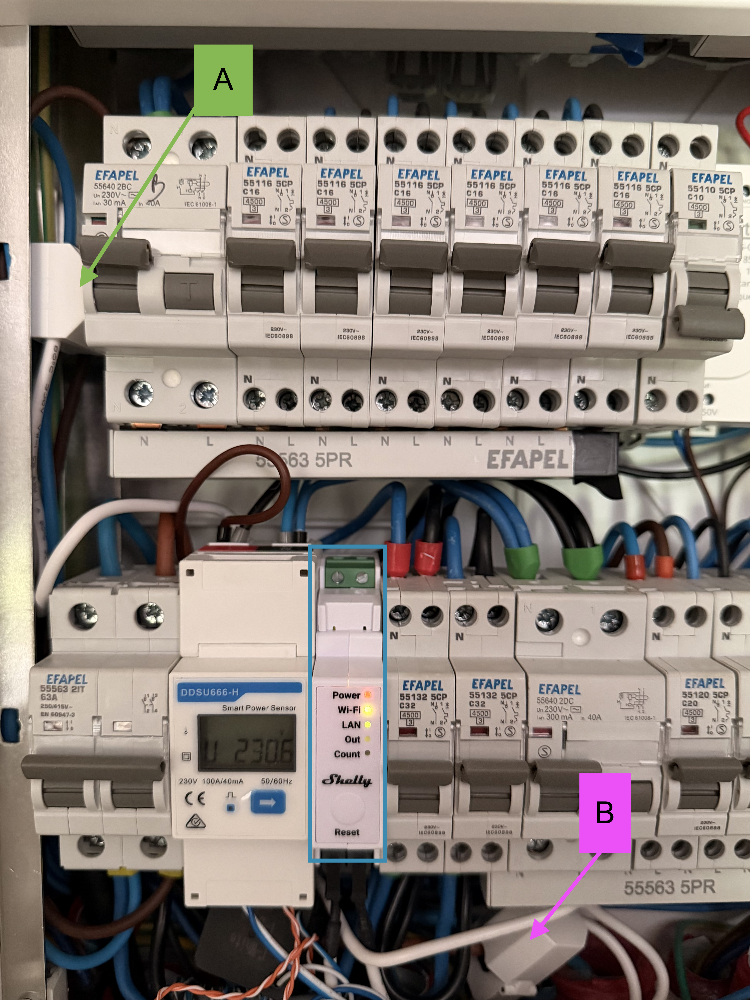
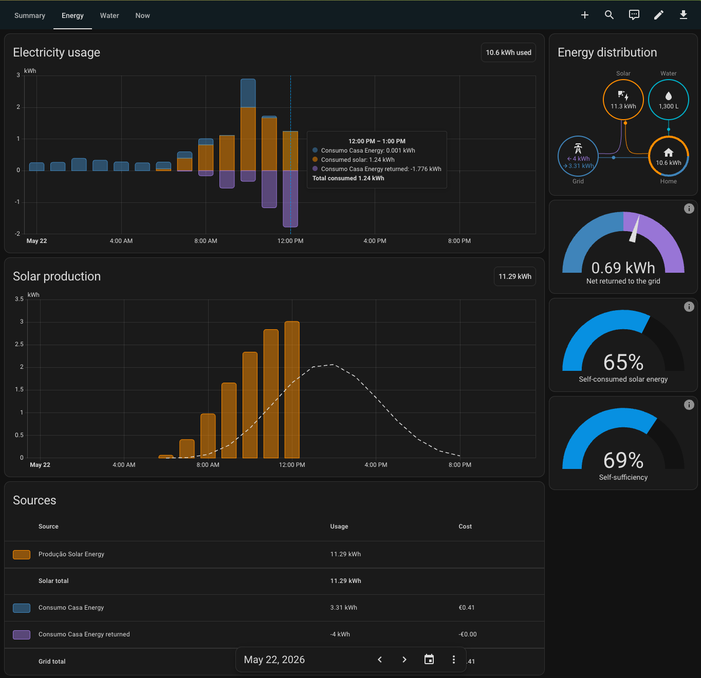
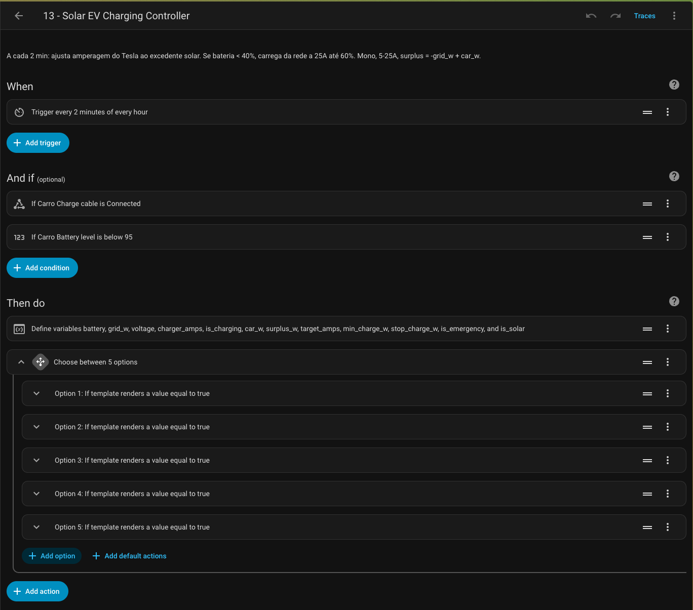
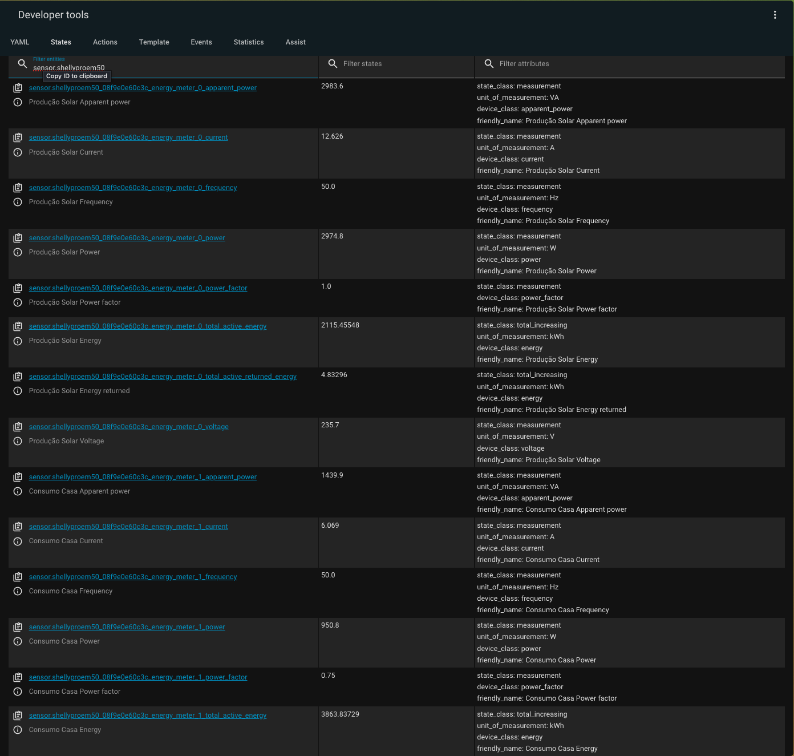

# Solar surplus EV charging with ShellyProEM50

Shelly Smart Home Challenge 2026, category: Scripting & Logic

Home Assistant automation that charges a Tesla from solar surplus only. A ShellyProEM50 reads solar production and grid import/export in real time, and Home Assistant (via the Tesla integration) adjusts the car's charging current every 2 minutes to match whatever surplus is available. The ShellyProEM50 is the sensor, Home Assistant is the brain, the Tesla integration is the actuator.

## The problem

I have solar panels on the roof and a Tesla in the garage. Most of the time, the car sits there all day while the panels export kilowatts to the grid. The car then charges at night from the grid. That's backwards.

Scheduled charging doesn't help because solar production changes constantly. A cloud passes, someone turns on the oven, and the surplus is gone. You can't set a fixed schedule for something that moves every few minutes.

I wanted the car to absorb whatever solar is left over, automatically, without pulling from the grid.

## How it works

A ShellyProEM50 on the electrical panel monitors two channels:
- Channel 0: solar production (also provides the voltage reading)
- Channel 1: grid net meter (positive = importing, negative = exporting)

Every 2 minutes, Home Assistant reads both channels and calculates:

```
surplus_W = (-grid_W) + car_W
target_amps = clamp(surplus_W / voltage, 5, 25)
```

One thing that tripped me up early: `car_W` (what the car is already drawing) has to be added back. Otherwise the automation sees the car's own consumption as household load and keeps reducing the current in a feedback loop until it shuts off.

## Hysteresis

Solar surplus fluctuates constantly. A cloud passes, the surplus dips, the cloud moves on, the surplus recovers. Without hysteresis, the charger would oscillate on/off every 2 minutes on a partly cloudy day. Bad for the contactor relay and bad for actual charging throughput.

The automation uses separate thresholds for starting and stopping, creating a dead band:

- Start: surplus >= 1150W (about 5A at 230V)
- Stop: surplus < 690W (about 3A at 230V)
- Between 690W and 1150W: hold current state. If charging, keep going at 5A minimum. If not charging, don't start.

A passing cloud that drops surplus from 1500W to 800W doesn't kill the session. Only a sustained drop below 690W stops charging.

## Modes

| Mode | When | What happens |
|------|------|--------------|
| Solar | Surplus >= 1150W | Charges at 5-25A, adjusts every 2 min |
| Emergency | Battery < 40% | Charges at 25A from grid until 60% |
| Idle | Surplus < 690W | Stops, waits for surplus to come back |

The workflow is simple: you come home, plug in the cable, and forget about it. The Tesla starts charging at 5A by default, but the automation detects this within 2 minutes and takes over. If there's enough surplus, it adjusts the current to match. If not, it stops the charge and waits for surplus to appear.

Emergency mode exists because sometimes the car comes home nearly empty and needs charge regardless of solar. Below 40% battery, it pulls 25A from the grid until it reaches 60%, then switches back to solar-only.

## Surplus reminder

A second automation sends a notification when the panels are exporting more than 1150W for over 10 minutes but the car isn't plugged in. The car has to be at home and battery below 90%. Above 90%, the Tesla tapers charging current regardless of what you set, so it wouldn't absorb the surplus in any useful way. One notification per hour max.

It's a simple nudge: "you're giving away energy, plug in the car."

## Architecture



## Hardware

| Device | Role | Entity |
|--------|------|--------|
| ShellyProEM50 | Energy monitoring | `sensor.shellyproem50_*_energy_meter_0_voltage`, `sensor.shellyproem50_*_energy_meter_1_power` |
| Tesla Wall Connector | EV charger, monophase, 5-25A | `switch.carro_charge`, `number.carro_charge_current` |
| Tesla (vehicle) | Battery level, charging state, location | `sensor.carro_battery_level`, `sensor.carro_charging`, `device_tracker.carro_location` |

## Limitations

This only works when the car is at home during sun hours. If you commute during the day, you won't get much out of it. It works well for remote workers or if the car stays home most days.

The Tesla Wall Connector has a minimum of 5A, so you need at least ~1150W of surplus to start a session. Smaller surpluses get exported to the grid regardless.

## Setup

### What you need

- Home Assistant with the [Shelly integration](https://www.home-assistant.io/integrations/shelly/) (native, no custom component)
- ShellyProEM50 on your electrical panel
- Tesla integration (native or custom) that exposes charging controls
- Single phase charging setup (the automation assumes monophase)

### Installation

1. Create the two `input_boolean` helpers from [`helpers.yaml`](helpers.yaml) (Settings > Helpers, or add to `configuration.yaml`)

2. Copy [`automation_solar_ev_charging.yaml`](automation_solar_ev_charging.yaml) and [`automation_surplus_reminder.yaml`](automation_surplus_reminder.yaml) into your automations (UI or `automations.yaml`)

3. Replace entity IDs with yours:
   - `sensor.shellyproem50_*` for your ShellyProEM50
   - `sensor.carro_*`, `switch.carro_*`, `number.carro_*` for your Tesla
   - `device_tracker.carro_location` for your car's location tracker

4. Check your ShellyProEM50 channel mapping. Channel 0 should be solar production, channel 1 should be the grid meter. Verify the sign: positive = importing, negative = exporting.

### Adapting to other setups

For three phase charging, divide surplus by 3 to get per-phase amps and adjust the clamp range to your charger's limits.

For a different EV, replace the Tesla entities with your charger's equivalents. Most smart chargers expose a current control entity.

Any Shelly energy meter works in place of the ProEM50. Just make sure you know which direction is import vs export on your meter.

## Screenshots

ShellyProEM50 installed on the electrical panel. A: solar production CT clamp, B: grid net meter CT clamp.



Energy dashboard showing solar production, consumption and grid export on a typical day:



The automation in Home Assistant, with the surplus calculation variables and the 5 charging mode branches:



ShellyProEM50 entities in Developer Tools, showing real time power and voltage readings:



## Known issues

The Tesla API updates its sensors slowly. `sensor.carro_charging` can lag behind actual state by several minutes, which caused duplicate notifications (the automation thought the car was still charging after it had been stopped). The fix was to use `switch.carro_charge` instead, which reflects the command we sent rather than waiting for the Tesla to report back.

This only affects notifications. The surplus calculation and charging control are not affected because the automation uses `number.carro_charge_current` (the target amps we set), and the Tesla enforces whatever current we tell it to draw.

## Next step: Shelly EM on the charger circuit

Adding a Shelly EM with a 50A clamp on the Wall Connector circuit would give a real time, independent power reading of what the charger is actually drawing. This would close the loop completely: instead of trusting that the Tesla draws what we asked, we'd measure it directly with Shelly hardware.

## Files

| File | What it does |
|------|--------------|
| [`automation_solar_ev_charging.yaml`](automation_solar_ev_charging.yaml) | Main automation: surplus calculation and charging control |
| [`automation_surplus_reminder.yaml`](automation_surplus_reminder.yaml) | Notification when surplus is available but car isn't plugged in |
| [`helpers.yaml`](helpers.yaml) | The two `input_boolean` helpers the automation needs |

## License

MIT
